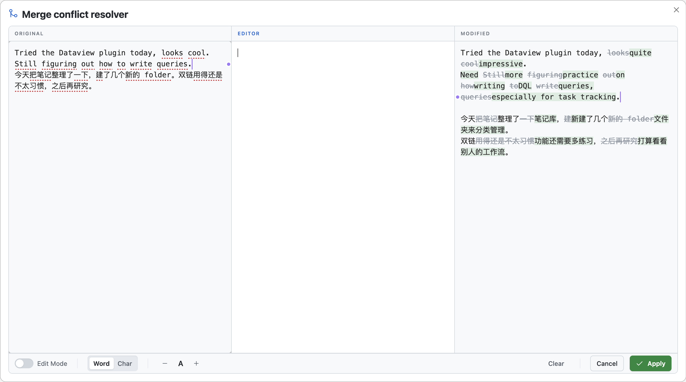

# Diff Apply (Obsidian Plugin)

[English](#english) | [中文](#中文)

## 中文

**痛点**：合并两版文本时，常需反复滚动对比、肉眼找差异、逐句复制粘贴——过程繁琐且易出错。

**方案**：三栏浮窗布局（原文 | 编辑区 | 修改版），差异高亮，文本便捷选取，中间栏编辑最终结果。

### 差异显示

**默认状态**：左栏红色标注删除内容，右栏绿色标注新增内容

**悬停状态**：鼠标悬停时，当前栏高亮弱化为虚线下划，另一栏显示完整增删对比

**段落定位**：两侧段落数不同时，分隔处显示 `●¹` `●²` 编号，便于跨栏定位。

### 文本选取

- 选中左/右栏文本后按 `Enter`：插入到编辑区光标处
- 双击某行：整行插入编辑区（自动换行）

### 其它功能

| 功能 | 说明 |
|:--|:--|
| Edit Mode | 左右栏变为可编辑状态，差异实时更新 |
| Diff 粒度 | Word / Char 切换，适配不同语言 |
| 字号调节 | 10–24px |

### 安装

1. 创建插件目录：`.obsidian/plugins/diff-apply/`
2. 将以下文件放入该目录：
   - `main.js`
   - `manifest.json`
   - `styles.css`
3. 在设置中启用 `Diff Apply`

---

## English

**Problem**: When merging two versions of text, you often have to scroll back and forth, spot differences manually, then copy/paste line by line—tedious and error-prone.

**Solution**: A 3-column floating window layout (Original | Editor | Modified) with diff highlights and convenient text picking. Edit the final result in the middle column.

### Diff Display

**Default**: deletions are marked in red on the left; additions are marked in green on the right.

**Hover**: when hovering, highlights in the current column are softened into dotted underlines, while the other column shows the full add/remove comparison.

**Paragraph markers**: when paragraph counts differ between sides, markers like `●¹` `●²` appear at separators to help you locate matching content across columns.

### Text Picking

- Select text in the left/right column and press `Enter`: insert at the editor cursor
- Double-click a line: insert the whole line (newline auto-added)

### Other Features

| Feature | Notes |
|--------|------|
| Edit Mode | Left/right columns become editable; the diff view updates in real time |
| Diff granularity | Switch Word / Char, useful for different languages |
| Font size | 10–24px |

### Installation

1. Create the plugin folder: `.obsidian/plugins/diff-apply/`
2. Put these files into the folder:
   - `main.js`
   - `manifest.json`
   - `styles.css`
3. Enable `Diff Apply` in Obsidian settings
