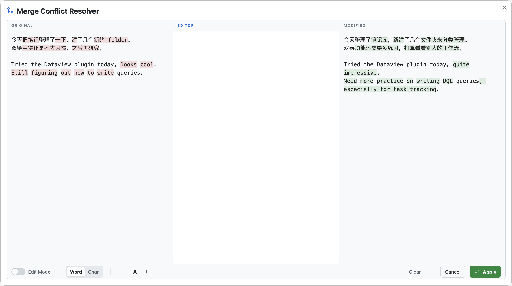
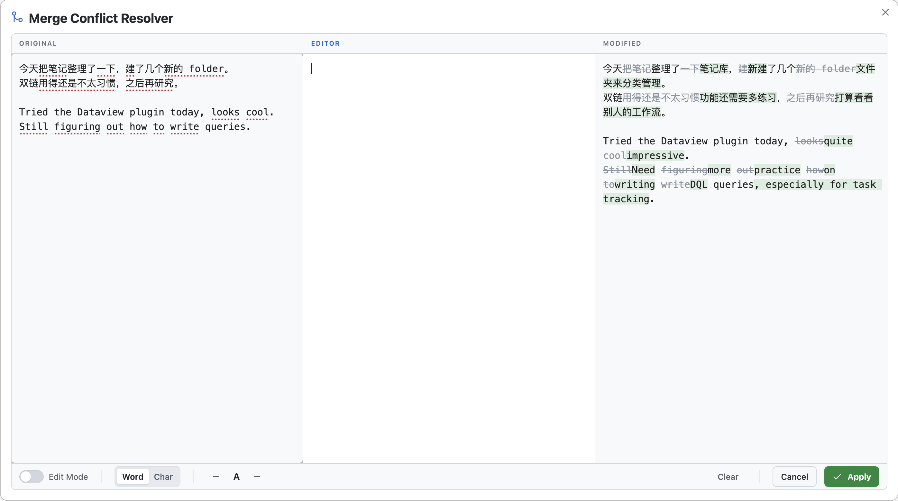

# Diff Apply (Obsidian Plugin)

[English](#english) | [中文](#中文)

## 中文

**痛点**：合并两版文本时，需反复滚动对比，肉眼找差异，逐句挑选复制、粘贴拼接——繁琐且易出错。

**方案**：三栏浮窗对比原文与新版，差异高亮一目了然（悬停时当前栏弱化、另一栏显示完整增删），中间栏编辑最终结果，一键替换回笔记。

| 默认状态 | 鼠标悬停(左栏) |
|:--------:|:------:|
|  |  |
| 左栏原文标红删除，右栏修改版标绿新增 | 当前栏弱化为下划点线，另一栏显示完整增删对比 |

**为什么这样设计？**
- **选字时不乱眼**：悬停栏的高亮弱化为点线，方便阅读与选取
- **余光能感知**：点线提示"此处有改动"，不会漏选
- **另一栏全貌**：同时展示增删，无需来回切换

> 如有更好方案，欢迎指正。 

### 快速开始

1. 复制修改版到剪贴板，选中笔记原文
2. 命令面板 `Diff Apply: Hybrid edit selection`
3. 从左右栏**挑选片段**到中间编辑
   - 在 Original/Modified 中选中文本后按 `Enter`，插入到 Editor 光标位置
   - 双击任意一行，把整行插入到 Editor (自动添加换行)
4. Apply 替换 / Cancel 放弃

### 其它功能

| 功能 | 说明 |
|------|------|
| Edit Mode | 左右栏变为可编辑模式，差异视图实时更改 |
| Diff 粒度 | Word / Char 切换，适用于不同语言 |
| 字号调节 | 10–24px |

### 安装

1. 创建插件目录：`.obsidian/plugins/diff-apply/`
2. 将以下文件放入该目录：
   - `main.js`
   - `manifest.json`
   - `styles.css`
3. 在设置中启用 `Diff Apply`

---

## English

**Problem**: When merging two versions of text, you often have to scroll back and forth, spot differences manually, then copy/paste and stitch sentences together—tedious and error-prone.

**Solution**: A 3-column floating diff window comparing the original and modified text with clear highlights. When hovering, the current column’s highlight is softened, while the other column shows the full add/remove diff. Edit the final result in the middle column and apply it back to your note in one click.

| Default | Hover (Left) |
|:------:|:------------:|
|  |  |
| Deletions are red in the left column; additions are green in the right column | The hovered column uses dotted-underlines, while the other column shows full add/remove highlights |

**Why this design?**
- **Easier to read while selecting**: highlights in the hovered column are softened into dotted underlines
- **Change-aware in peripheral vision**: dotted cues tell you “something changed here” without being distracting
- **Full context in the other column**: additions and deletions are both visible, no constant toggling

> Suggestions and improvements are welcome.

### Quick Start

1. Copy the *modified* version to your clipboard, then select the *original* text in your note
2. Command palette: `Diff Apply: Hybrid edit selection`
3. Pick fragments from left/right into the middle editor
   - Select text in Original/Modified and press `Enter` to insert at the editor cursor
   - Double-click any line to insert the whole line (newline auto-added)
4. `Apply` to replace / `Cancel` to discard

### Other Features

| Feature | Notes |
|--------|------|
| Edit Mode | Left/right columns become editable; the diff view updates in real time |
| Diff granularity | Switch Word / Char, useful for different languages |
| Font size | 10–24px |

### Installation

1. Create the plugin folder: `.obsidian/plugins/diff-apply/`
2. Put these files into the folder:
   - `main.js`
   - `manifest.json`
   - `styles.css`
3. Enable `Diff Apply` in Obsidian settings
