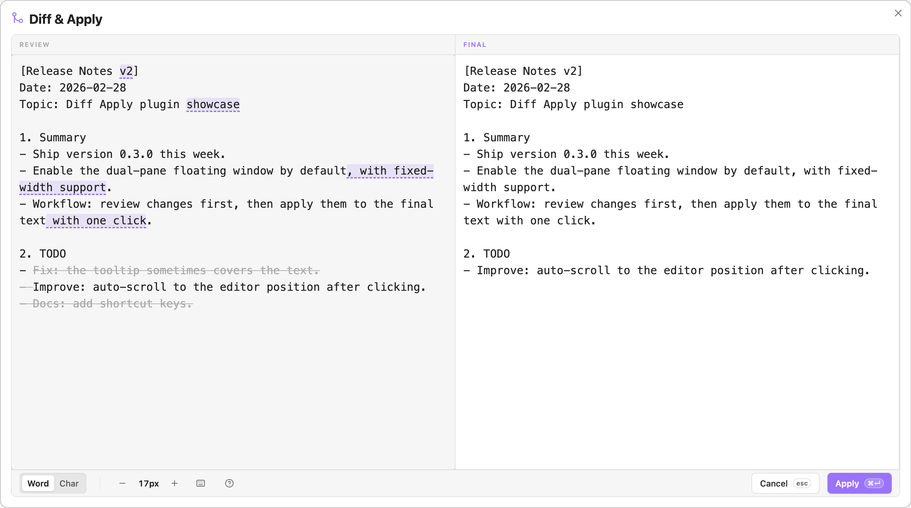

# Diff Apply (Obsidian Plugin)

## 为什么需要它？

处理长文本的修订与合并（例如：翻译校对、AI 润色结果比对、多版本草稿合并）时，常规流程往往是：**反复滚动对比 → 肉眼寻找差异 → 逐句复制粘贴**。这不仅效率低下，还极易出现漏改、改错或贴错位置的情况。

而传统 Diff 工具多为「代码比对」设计，并不完全适用于「差异零碎、编辑灵活」的文本场景。

本项目专注于「文本 Diff 合并」场景，通过直观的双栏浮窗完成「差异审阅 + 即时编辑」，把繁琐的来回对照与复制粘贴，变成便捷的点按/键盘操作，将精力留给内容取舍的决策本身。

## 核心特性

### 1. 双栏浮窗面板

- **左侧：Review（差异审阅区）**  
  实时展示 **原文（当前选中文本）** 与 **终稿（初始从剪贴板读取）** 的 Diff 结果，并支持直接交互操作差异片段。

- **右侧：FINAL（终稿编辑区）**  
  可直接编辑终稿文本；光标位置与左侧 Diff 结果保持高亮联动，帮助精准定位对应片段。

### 2. 差异视觉呈现

抛弃杂乱的代码级 Diff 标记，Review 区仅用两种基础样式表达「新增 / 删除 / 替换」三类差异语义，保持信息密度和可读性之间的平衡：

- **高亮背景色**：终稿相对原文的 **新增 / 替换** 内容  
- **灰色背景 + 删除线**：终稿相对原文的 **删除** 内容

### 3. “所见即所得”交互规则

**交互设计思路：选中用来“提示将发生什么”，执行用来“完成该动作”**。Review 区不仅是展示区，更是操作区。**支持鼠标与键盘两种操作方式，两者触发相同的交互反馈**。

| 差异类型 | 视觉呈现 | 鼠标悬停/键盘选中状态 | 鼠标点击/键盘执行操作 |
| :--- | :--- | :--- | :--- |
| **替换** *(双方内容不同)* | 高亮背景 | 弹出 Tooltip 显示对应原文内容，右侧同步高亮定位 | 一键将**原文片段**注入右侧编辑区，覆盖当前终稿 |
| **新增** *(终稿有，原文无)* | 高亮背景 | 变为**灰色背景+删除线** (暗示操作后将删除) | 右侧编辑区**一键删除**该新增片段 |
| **删除** *(终稿无，原文有)* | 灰色删除线 | 变为**普通文本样式** (暗示操作后将添加) | 右侧编辑区对应位置**一键插入**该缺失片段 |

<video src="https://github.com/user-attachments/assets/3fbaad11-5bcb-4102-8fb2-d6b0e623c0be" controls="controls" width="100%"></video>

### 4. 操作方式与其他辅助功能

- **多模式操作**：支持鼠标悬停操作，也支持**纯键盘模式**（快捷键 `Mod+Shift+K` 或点击底部键盘图标开启，使用 `↑/↓` 切换标记，`Enter` 注入）。
- **智能跳转**：若差异标记位于屏幕外，首次点击跳转定位，再次点击执行合并。
- **细节调整**：底部工具栏可实时切换对比粒度（`Word` 单词级 / `Char` 字符级）与字体大小（10–24px）。
- **撤销回退**：右侧编辑区完整支持撤销/重做（`Mod+Z` / `Mod+Shift+Z` / `Mod+Y`）。

## 工作流程

1. **选定原文**：在 Obsidian 中选中需要审阅的原始文本（ORIGINAL）
2. **打开面板**：运行命令 `Review & Apply Selection` 呼出对比面板
3. **加载终稿**：右侧终稿（FINAL）初始内容自动读取系统剪贴板
4. **审阅与操作**：在左侧查看差异，直接点击差异片段进行快速替换/删除，或在右侧进行自由手动编辑
5. **应用或取消**：将右侧最终结果替换回最初选区或直接退出

## 安装与启用

1. 在库中创建插件目录：`.obsidian/plugins/diff-apply/`
2. 将发布文件放入该目录：
   - `main.js`
   - `manifest.json`
   - `styles.css`
3. 重启 Obsidian，在 **设置 → 第三方插件** 中启用 **Diff Apply**
